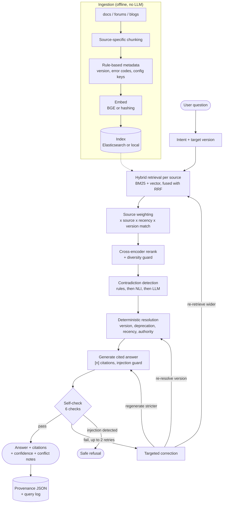

# Corvex: Multi-Source RAG

A Retrieval-Augmented Generation system that answers technical-support questions about a
fictional distributed job queue (**Corvex**) by retrieving from three sources that
sometimes disagree: **product documentation**, **customer forums**, and **technical blogs**.

The interesting part is not the LLM call. It is everything around it: source-aware
chunking, hybrid retrieval, cross-source contradiction detection with deterministic
resolution, a bounded self-check and correction loop, and a full provenance trace for every
answer.

## Why it is hard

| Source | Strength | Failure mode |
|---|---|---|
| Documentation | Official and normative | Can lag reality |
| Forums | Real symptoms and workarounds | Outdated or confidently wrong answers, prompt-injection text |
| Blogs | Architecture and tuning narratives | Frozen at publish date, show deprecated APIs |

The corpus is seeded with real conflicts: the default retention changed from 7 days (v1) to
24 hours (v2), the worker config key was renamed, API auth moved from a query token to a
Bearer header, and one forum answer recommends a harmful fix. A naive RAG system blends or
randomly picks between these. This one detects and resolves them, and shows its reasoning.

## Workflow



### Stage by stage

1. **Ingestion.** Docs are split by heading and never inside code blocks. Forum threads pair
   a question with its accepted answer and drop trivial replies. Blogs split by heading,
   with an embedding-based split only inside oversized sections. Chunk IDs are stable
   hashes, so re-ingesting unchanged input is idempotent.
2. **Retrieval.** BM25 and vector search run per source and are fused with Reciprocal Rank
   Fusion. Scores are then multiplied by a source weight, a recency decay and a version-match
   factor. A cross-encoder reranks the pool, and a diversity guard keeps at least two
   sources in the final top-K.
3. **Contradiction handling.** Claims are extracted by rules, flagged by an NLI model, and
   adjudicated by an LLM only for flagged pairs. A fixed cascade picks a winner: version
   match, explicit deprecation, recency, then authority. If nothing decides, both sides are
   shown.
4. **Generation.** The model answers only from the numbered evidence, cites every claim, and
   is told to ignore instructions found inside evidence.
5. **Verification.** Six checks run on the draft: citation validity, grounding, relevance,
   version correctness, contradiction consistency, injection safety. Each failure routes
   to a specific fix, capped at two iterations. An injection failure goes straight to a
   safe refusal.
6. **Observability.** Every query writes a provenance trace (candidates, scoring factors,
   decisions, check scores, latency, tokens, config hash) and a line in `queries.jsonl`.

## Key design decisions

| Decision | Reason |
|---|---|
| Elasticsearch only, Weaviate dropped | Elasticsearch already does BM25, vectors and hybrid fusion |
| Reciprocal Rank Fusion | Rank-based, so no fragile score normalisation across BM25 and cosine |
| Structure-first chunking | Deterministic and explainable; semantic splitting only where there is no structure |
| BGE embeddings and reranker | Free, local, deterministic; Cohere kept as an opt-in comparison |
| Static source weighting shipped | Adaptive weighting is built but stays off until the ablation shows it wins |
| Rule cascade for conflicts | Auditable, unlike letting an LLM pick a winner |
| Groq plus MockLLM fallback | Free-tier LLM behind one shared rate limiter; always runnable offline |
| Plain Python, no agent framework | Every stage is inspectable and testable on its own |

The full reasoning, including where this diverges from the original brief (`sch.md`), is in
[DESIGN.md](DESIGN.md).

## Quick start

### Zero-dependency path (no Docker, no network, no keys)

This is also what the tests and CI use.

```bash
pip install -r requirements.txt
python -m corvex_rag.cli ingest
python -m corvex_rag.cli ask "What is the default retention period for completed jobs?"
python -m corvex_rag.cli eval --skip-ragas
```

Windows without `make`: use `python tasks.py <ingest|ask|eval|ablate|test|doctor>` or
`scripts\bootstrap.ps1`.

### Full path (Elasticsearch + BGE + Groq)

```bash
pip install -r requirements-optional.txt
cp .env.example .env        # then fill in the keys below
```

```
GROQ_API_KEY=...            # console.groq.com
ELASTIC_API_KEY=...         # Kibana > Management > API keys ("Encoded" value)
ELASTIC_HOST=https://<project>.es.<region>.<cloud>.elastic.cloud
```

```bash
python -m corvex_rag.cli doctor                              # checks ES connection and keys
python -m corvex_rag.cli ingest
python -m corvex_rag.cli ask "How do I fix CVX-4210?" --show-provenance
python -m corvex_rag.cli eval
python -m corvex_rag.cli ablate --axis reranker
```

Groq's Llama models are not on every account. The default model is `openai/gpt-oss-120b`;
list the models your key can use with:

```bash
python -c "import os; from dotenv import load_dotenv; load_dotenv(); from groq import Groq; [print(m.id) for m in Groq().models.list().data]"
```

**Latency:** about 40 to 90 seconds per query on CPU with the BGE reranker, NLI model and
Groq round trips. Set `reranker.provider: lexical` and `contradiction.nli.enabled: false`
for about 5 seconds per query.

## Evaluation

| Layer | What it measures |
|---|---|
| Retrieval metrics (deterministic) | NDCG@k, MRR, Recall@k, context precision and recall, per-source recall |
| RAGAS-style (LLM-judged, cached) | Faithfulness, answer relevancy, context precision and recall, answer correctness |
| Ablations (`ablate --axis ...`) | Retrieval mode, reranker, source weighting, contradiction handling, self-check, chunking, embedding |
| Edge-case suite | 10 behavioural categories, including no-answer, version conflict and prompt injection |

Datasets live in `evaluation/` and are described in [evaluation/README.md](evaluation/README.md).

## Project layout

```
data/                three sources for Corvex, plus the sources.yaml registry
evaluation/          questions, ground truth, retrieval cases, contradiction cases, edge cases
corvex_rag/
  schema.py          typed contracts passed between every stage
  config.py          config load, validate, hash
  rate_limit.py      shared per-provider rate limiter with persisted daily quota
  ingest/            loaders, markdown parser, per-source chunkers, enrichment, embedding
  index/             SearchBackend: local (numpy + rank_bm25) or Elasticsearch
  retrieve/          intent, hybrid RRF, source weighting, rerank (lexical, BGE, Cohere)
  reason/            NLI and rule-based contradiction detection, resolution, context builder
  generate/          LLM adapters (Groq, MockLLM), prompts, generator
  verify/            self-check (6 checks) and bounded corrector loop
  observability/     provenance traces, query log, feedback store
  eval/              retrieval metrics, RAGAS-style scorer, ablations, edge-case suite
  pipeline.py        RAGPipeline.answer(), the end-to-end orchestration
  cli.py             ingest | ask | eval | ablate | feedback | doctor
tests/               29 tests: rate limiter, chunking, retrieval, pipeline, eval, dataset checks
```

## More documentation

- [DESIGN.md](DESIGN.md): architecture and every trade-off
- [docs/TECHNICAL.md](docs/TECHNICAL.md): technical write-up of each pipeline stage
- [docs/STAKEHOLDERS.md](docs/STAKEHOLDERS.md): plain-language overview
- [sch.md](sch.md): the original task brief
